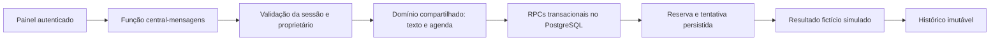

# Central de Mensagens — etapa 2 em simulação

O painel passa a concentrar agenda, textos, regras e histórico por usuário. Esta entrega permite revisar e testar o fluxo completo sem conexão com o WhatsApp. Os botões são explícitos: uma simulação produz somente um registro fictício. Nenhum endpoint de transporte, cron ou envio de teste foi implementado nesta etapa.

## Revisão do PR #17

A revisão corrigiu três falhas da base antes de avançar: respostas de sincronização atrasadas podiam repor dados após sair da conta; telefones internacionais com DDI explícito podiam receber o prefixo brasileiro; diferenças de caixa/espaços nos aeroportos podiam escapar da deduplicação de conversa. Há regressões para logout com edição tardia, conta trocada em outra aba, telefone internacional e chave de conversa normalizada.

Na revisão da etapa 2 também foram corrigidos: associação de IDs de cliente ausentes; retorno multitrecho inferido incorretamente; perda de segundos ou bloqueio por horário de verão ao salvar modelos sem editar a chegada; identificação histórica pelo cadastro atual em vez do snapshot original; e alteração da fonte entre leitura e preparação sem incremento da versão.

## O que aparece na tela

| Área | Comportamento |
| --- | --- |
| Agenda | Lista tarefas, contato, trecho, horário e validade; prévia, pausa, retomada, cancelamento e simulação. Mostra pendências que impedem preparar a viagem. |
| Modelos | Edita cinco tipos de aviso com variáveis permitidas; preserva quebras de linha e mostra dados fictícios na prévia. |
| Regras | Pausa geral, modelo ativo, antecedência, validade, silêncio e fuso do operador. Por venda: emissão confirmada, fusos da ida/volta e chegada final em data, hora e fuso. |
| Histórico | Eventos imutáveis da conta, com destinatário e texto da tentativa preservados. `simulada` não significa enviada ou entregue. |

Defaults: agenda pausada, silêncio 21h–08h em America/Sao_Paulo, validade de 15 minutos. A regra de pós-chegada inicia desativada. O número de teste é apenas configuração; não existe ação que envie a ele.

O menu atual recebeu o acesso Mensagens. A troca geral por navegação lateral permanece na etapa 4. Cotação, WhatsApp Web, tags e follow-up sem resposta pertencem à etapa 3.

## Fluxo e dados



Os dados operacionais continuam em `dados_app`; a Central lê a fonte da conta autenticada. Sua abertura não inicia a sincronização do cache nem grava `dados_app`. Preferências ficam em `mensagens_preferencias`, tarefas em `mensagens_tarefas` e eventos em `mensagens_historico`. O schema privado `mensagens_privado` mantém exclusão mútua por conversa.

RLS permite ao usuário autenticado somente ler os registros próprios. Escritas e RPCs ficam restritas ao papel de serviço no backend. A identidade vem de Auth, nunca do corpo enviado pelo navegador. A resposta pública não inclui credenciais, CPF, custos, tokens de reserva ou o snapshot bruto da fonte.

`mensagens_fonte(uuid)` retorna versão, conteúdo e fingerprint da mesma leitura. `mensagens_preparar(uuid,bigint,bigint,jsonb,text)` compara novamente a versão e o fingerprint sob lock. O hash por tarefa inclui venda, contato e cotações vinculadas: uma edição sem incremento de versão também invalida a reserva anterior. Configurações usam controle de versão; conflito 409 preserva a edição na tela e exige revisão, sem sobrescrita automática.

O banco revalida pausa, arquivamento, versões, fonte, horário de silêncio e prazo com seu relógio. A reserva usa token de tentativa, bloqueio da conversa e transações. A tentativa é persistida antes do resultado fictício. Quando o resultado fica incerto, não há repetição automática nem liberação do bloqueio por tempo decorrido.

## Regras conservadoras

- Salvar uma venda como emitida não basta: a Central exige a confirmação explícita da emissão e dos fusos.
- Horários locais inexistentes ou ambíguos por mudança de fuso exigem revisão. Uma chegada já salva com instante exato permanece intacta ao editar apenas o modelo.
- Pós-viagem usa chegada final confirmada, posterior à partida de volta. Não usa a hora de partida como chegada.
- O cadastro de vendas ainda não representa aeroportos independentes na volta. Ao detectar multitrecho na cotação vinculada, suspende retorno e pós-viagem com pendência explícita; avisos de ida continuam elegíveis.
- Mensagens vencidas conservam o vencimento. Retomar ou atualizar a agenda não desloca tarefas antigas para agora. Cancelamento manual não é revertido por uma nova preparação.
- Antes do voo, um horário em silêncio é antecipado para a faixa permitida anterior. Após a chegada, é adiado até a faixa permitida seguinte. A faixa deve ser revisada antes de qualquer ativação real.
- O texto usa o modelo congelado da tarefa; “hoje” e “amanhã” são recalculados no instante da simulação, no fuso do voo.

## Arquivos principais

- `mensagens.html`, `css/messages.css`, `js/messages-page.mjs`: interface.
- `js/messages-api.js`: chamada autenticada da função; erros não são substituídos por dados fictícios.
- `js/messages-domain.mjs`: validação, composição e planejamento compartilhados.
- `supabase/functions/central-mensagens/index.ts`: entrypoint novo, fechado por padrão.
- `supabase/functions/_shared/central-mensagens/`: handler, adaptador REST/Auth, CORS e documentação detalhada.
- `supabase/migrations/20261004213417_central_mensagens.sql`: schema e contrato transacional, ainda não aplicados em produção.

Mesmo em ambiente de teste autorizado, a função exige `CENTRAL_MENSAGENS_HABILITADA=simulacao`; nenhum valor ativa envio real. CORS aceita somente origens exatas configuradas. A lista de variáveis e o contrato HTTP estão no [README do backend](supabase/functions/_shared/central-mensagens/README.md).

## Como verificar localmente

Requisitos: Node 22.19 ou superior, Deno 2 e PostgreSQL 17. O cotador fornece o jsdom usado pelos testes da interface.

```sh
npm ci --ignore-scripts
npm --prefix cotador ci --ignore-scripts
npm test
npm --prefix cotador test
deno test --no-config --no-lock --cached-only supabase/functions/tests/pos-venda-candidate/ supabase/functions/tests/central-mensagens/
deno check --no-config --no-lock supabase/functions/central-mensagens/index.ts
deno lint --no-config supabase/functions/_shared/central-mensagens/ supabase/functions/central-mensagens/ supabase/functions/tests/central-mensagens/
npm run test:db
```

Se necessário, `VCK_PG_BIN` aponta para a pasta dos executáveis do PostgreSQL. O teste de banco ignora URLs operacionais, cria porta aleatória em 127.0.0.1 e banco `vck_central_test`, aplica o bootstrap fictício e somente a migration da Central. Ao terminar, encerra e remove seu próprio cluster temporário. Não cria serviço do sistema.

As suítes de banco exercitam RLS real com papéis separados, chamadas simultâneas à mesma tarefa e conversa, pausas antes/depois do início, CAS de preferências, fonte alterada sem subir versão, expiração, tokens e histórico imutável. A integração handler → adaptador → PostgreSQL usa Auth e envelope REST simulados, com consultas e transações reais. Isso não equivale a homologação do Supabase completo.

A revisão visual usa somente um adaptador em memória e dados fictícios, separado dos testes do banco. Confere desktop e largura de celular, edição/prévia, agenda e resultado simulado. Não comprova persistência remota.

## Limites e próxima liberação

Não houve merge, publicação, migration em produção, alteração da função `pos-venda` v9, cron ou configuração Z-API. O arquivo arquivado da v9 permanece com SHA-256 `24abc67772e29404e8436202db756b392c674c9beccc2dc6a7ee084d6acf3864`.

A lista retorna até 500 tarefas e 200 eventos; não é uma exportação completa. Histórico legado não foi migrado porque a propriedade dos registros precisa ser estabelecida. Retorno multitrecho precisa de campos próprios antes de ser liberado. Não há reconciliação com provedor, webhook, transporte real ou agendamento automático.

Antes de operação real, é necessário homologar em projeto isolado o Auth/REST, RLS, bundle da Edge Function, frontend e backup/restauração. Depois, com autorização específica, testar o transporte em número controlado e trocar a automação antiga por um único disparador. Follow-up por ausência de resposta depende de captura confiável das respostas e da associação com a proposta correta.

Referências técnicas verificadas: [RLS no Supabase](https://supabase.com/docs/guides/database/postgres/row-level-security), [funções de banco](https://supabase.com/docs/guides/database/functions), [bloqueios de linhas no PostgreSQL](https://www.postgresql.org/docs/current/sql-select.html). As garantias descritas acima também foram exercitadas pelas suítes locais; não são uma afirmação sobre o ambiente de produção.
